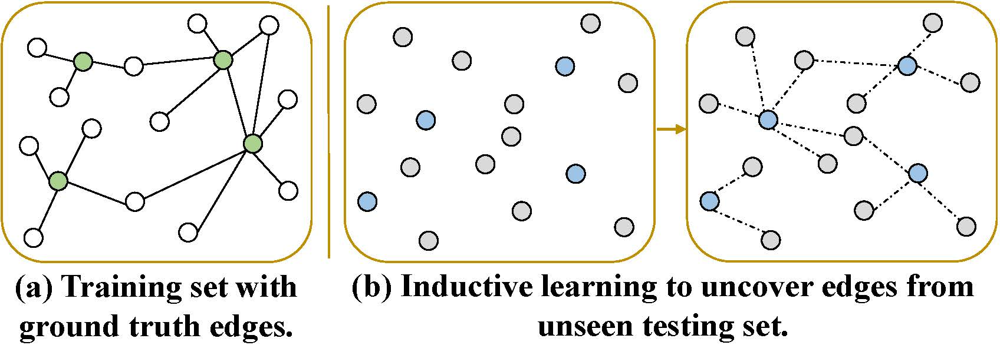
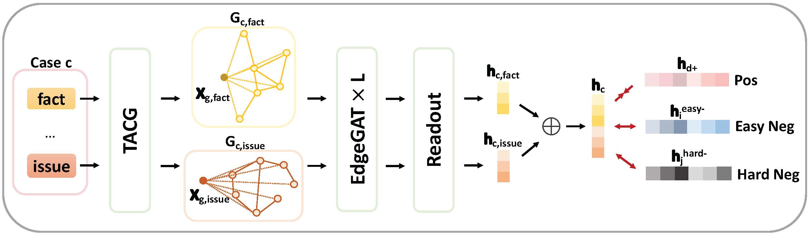
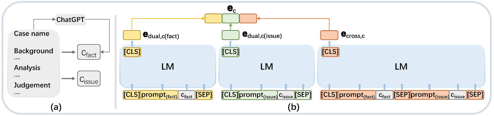

汤嫣然

I am currently a PhD student at <a href="https://www.uq.edu.au" target="_blank"> The University of Queensland (UQ)</a>, supervised by <a href="http://staff.itee.uq.edu.au/huang/" target="_blank"> Helen Huang</a> and <a href="https://researchers.uq.edu.au/researcher/973" target="_blank"> Xue Li</a>. I obataied my Bachelor of Law (LL.B.) and Master of Law (LL.M.) degrees in 2018 and 2021 respectively.

My research focuses on artificial intelligence in legal domain, including legal case retrieval and graph neural networks for legal cases etc.

I speak Cantonese, English, and Mandarin.

Publication
=====
<a href="https://scholar.google.com.au/citations?user=KmR5XoQAAAAJ&hl=en" target="_blank">Google Scholar</a> page includes the full publication list.

<table style="width:100%;border:0px;border-spacing:0px;border-collapse:separate;margin-right:auto;margin-left:auto;font-size:1em;"><tbody>
          <tr>
            <td style="padding:0 12px 0 0;width:25%;vertical-align:middle">
              
            </td>
            <td width="75%" valign="middle">
              <strong>CaseLink: Inductive Graph Learning for Legal Case Retrieval</strong>
               
              <strong>Yanran Tang</strong>, Ruihong Qiu, Hongzhi Yin, Xue Li, and Zi Huang
               
              SIGIR 2024
               
              <a href="https://arxiv.org/abs/2403.17780" target="_blank">arXiv</a> /
              <a href="https://github.com/yanran-tang/CaseLink" target="_blank">code</a>
              

              

              

                An inductive graph learning paradigm for legal case retrieval is proposed to tackle the challenge of unseen testing query and candidate cases .
              

            </td>
          </tr>
          <tr>
            <td style="padding:0 12px 0 0;width:25%;vertical-align:middle">
              
            </td>
            <td width="75%" valign="middle">
              <strong>CaseGNN: Graph Neural Networks for Legal Case Retrieval with Text-Attributed Graphs</strong>
               
              <strong>Yanran Tang</strong>, Ruihong Qiu, Yilun Liu, Xue Li, Zi Huang
               
              ECIR 2024
               
              <a href="https://arxiv.org/abs/2312.11229" target="_blank">arXiv</a> /
              <a href="https://github.com/yanran-tang/CaseGNN" target="_blank">code</a>
              

              

              

                A structural modelling of law case with GNN for effective retrieval is introduced.
              

            </td>
          </tr>
          <tr>
            <td style="padding:0 12px 0 0;width:25%;vertical-align:middle">
              
            </td>
            <td width="75%" valign="middle">
              <strong>Prompt-based Effective Input Reformulation for Legal Case Retrieval</strong>
               
              <strong>Yanran Tang</strong>, Ruihong Qiu, Xue Li
               
              ADC 2023
               
              <a href="https://arxiv.org/abs/2309.02962" target="_blank">arXiv</a> /
              <a href="https://github.com/yanran-tang/PromptCase" target="_blank">code</a>
              

              

              

                An effective legal case retriver that focus on legal feature alignment with the aid of LM prompting and LLM summarisation is introduced.
              

            </td>
          </tr>

</tbody>
</table>

Honors and Awards
=====
* **Student Support Grants**, ECIR 2024
* **Third Prize** in Task 1: Legal Case Retrieval, Competition on Legal Information Extraction/Entailment (COLIEE) 2023
* **Third Prize** in Legal Case Retrieval Track, Competition of Challenge of AI in Law (CAIL) 2023
* **Gold CIRES-ADC Travel Grant**, CIRES PhD School and the Australasian Database Conference (ADC) 2023
* **UQ Graduate School Scholarship**, Graduate School, The University of Queensland (2023-2026)
* **SCUT Graduate Scholarship**, School of Law, South China University of Technology (2018-2021)

Updated on 7/4/2024.

