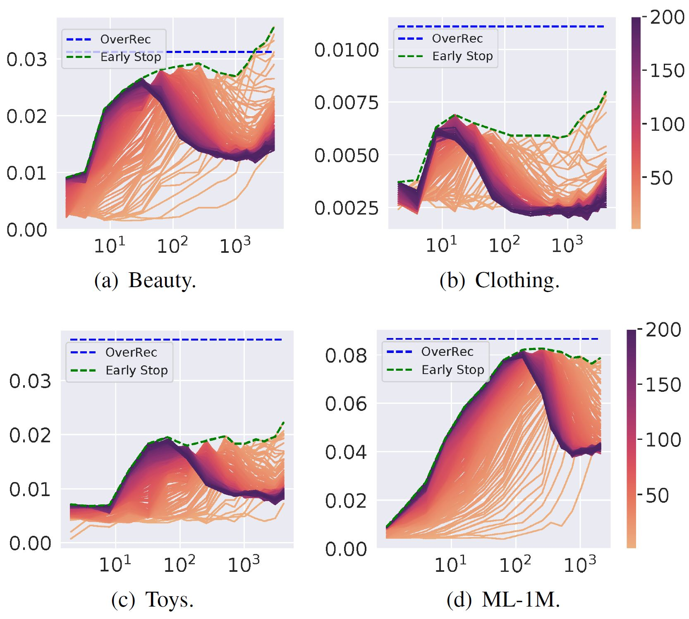
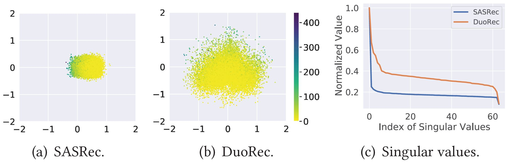
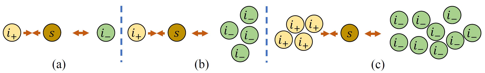
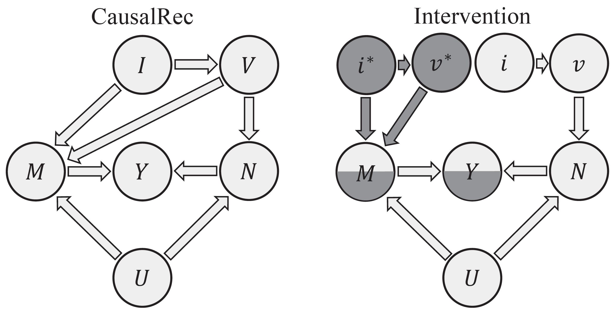
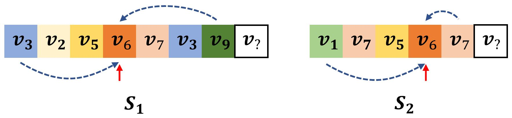
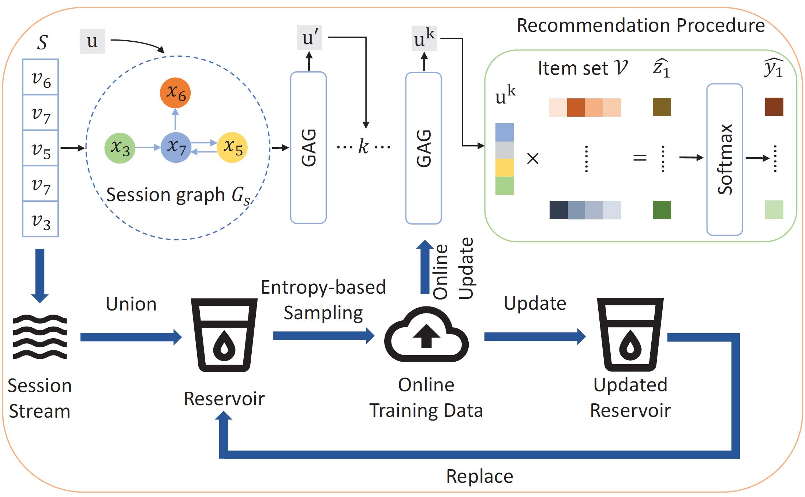
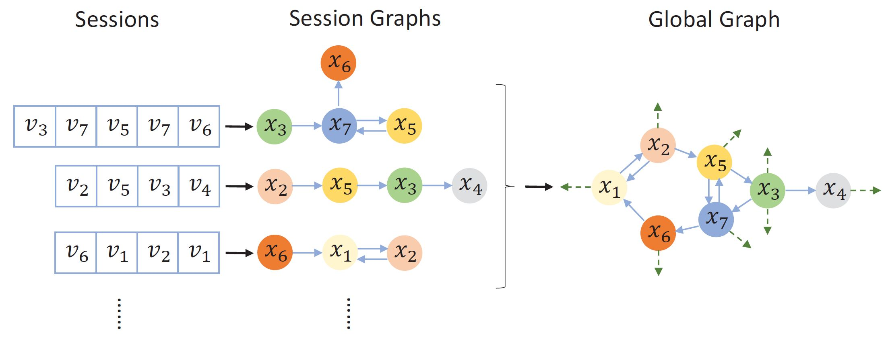
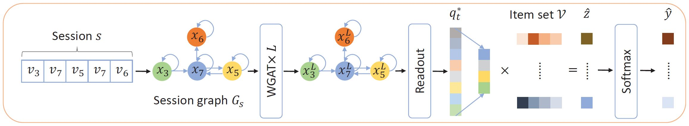

邱瑞鸿 /`ray hong chill/

I am currently an Associate Lecturer and a Postdoctoral Research Fellow at <a href="https://www.uq.edu.au" target="_blank"> The University of Queensland (UQ)</a>. I did my PhD in computer science from 2019 to 2022 at UQ, working with <a href="http://staff.itee.uq.edu.au/huang/" target="_blank"> Helen Huang</a>, <a href="https://sites.google.com/view/hongzhi-yin/home" target="_blank"> Hongzhi Yin</a>, and <a href="https://www.cityu.edu.hk/see/people/prof-zhiguo-yuan-am" target="_blank"> Zhiguo Yuan</a>. I did my bachelor at <a href="http://www.buaa.edu.cn" target="_blank"> Beihang University (BUAA)</a> from 2014 to 2018.

My research focuses on data science methods, including theory and application for various real-world scenarios, such as recommender systems, social network, urban computing, engineering, law, health etc.

I speak Cantonese, English, and Mandarin.

<a href="./recruit">
Recruitment: Open positions all year round!</a>

Recent News
=====
* 11.2023 Give a talk, "Graph Condensation for Continual Graph Learning", at Artificial Intelligence Enabled Trustworthy Recommendations Workshop at AJCAI 2023.

* 11.2023 **Best Paper Award** at ADC 2023 with my student, Yan!

* 08.2023 Give a talk, "Recent Advances of Data Science Methods in Public Health", at ICIAM, Busan.

* 07.2023 **Winner** of Task 2 and 4 at Social Media Mining for Health Competition (SMM4H) 2023!

* 11.2022 Give a talk, "Item- and Sequence-level Contrastive Learning in Sequential Recommendation" at TIGER Seminar at RMIT.

* 06.2022 Give a talk, "Item- and Sequence-level Contrastive Learning in Sequential Recommendation" at IR Seminar at the University of Glasgow.

* 12.2021 ACM MM Asia 2021 PhD Lightning Talk Award, **Highly Commended**.

* 07.2020 3MT competition **Runner-up** and **People's Choice Awards** at ITEE [\[video\]](https://www.youtube.com/watch?v=zVEHeSwpHYo&t=4s).

Selected Research
=====
<a href="https://scholar.google.com/citations?user=zbRZyuEAAAAJ" target="_blank">Google Scholar</a> page includes the full publication list.

<table style="width:100%;border:0px;border-spacing:0px;border-collapse:separate;margin-right:auto;margin-left:auto;font-size:1em;"><tbody>
          <tr>
            <td style="padding:0 12px 0 0;width:25%;vertical-align:middle">
              
            </td>
            <td width="75%" valign="middle">
              <strong>CaT: Balanced Continual Graph Learning with Graph Condensation</strong>
               
              Yilun Liu, <strong>Ruihong Qiu</strong>, Zi Huang
               
              ICDM 2023
               
              <a href="https://arxiv.org/abs/2309.09455" target="_blank">arXiv</a> /
              <a href="https://github.com/superallen13/CaT-CGL" target="_blank">code</a>
              

              

              

                We introduce a memory-based continual graph learning algorithm using graph condensation to construct a more representative memory bank. And a Train-in-Memory continual learning scheme can further alleviate the imbalanced training issue in Class Incremental Learning (CaT🐱).
              

            </td>
          </tr>
          <tr>
            <td style="padding:0 12px 0 0;width:25%;vertical-align:middle">
              
            </td>
            <td width="75%" valign="middle">
              <strong>Beyond Double Ascent via Recurrent Neural Tangent Kernel in Sequential Recommendation</strong>
               
              <strong>Ruihong Qiu</strong>, Zi Huang, Hongzhi Yin
               
              ICDM 2022
               
              <a href="https://arxiv.org/abs/2209.03735" target="_blank">arXiv</a> /
              <a href="https://github.com/RuihongQiu/OverRec" target="_blank">code</a> /
              <a href="https://www.youtube.com/watch?v=_jtvL4ROmq0&ab_channel=RuihongQiu" target="_blank">video</a>
              

              

              

                We introduce shared input-output embedding Recurrent Neural Tangent Kernel to sequential recommendation (OverRec). 
              

            </td>
          </tr>
          <tr>
            <td style="padding:0 12px 0 0;width:25%;vertical-align:middle">
              
            </td>
            <td width="75%" valign="middle">
              <strong>Contrastive Learning for Representation Degeneration Problem in Sequential Recommendation</strong>
               
              <strong>Ruihong Qiu</strong>, Zi Huang, Hongzhi Yin, Zijian Wang
               
              WSDM 2022
               
              <a href="https://arxiv.org/abs/2110.05730" target="_blank">arXiv</a> /
              <a href="https://github.com/RuihongQiu/DuoRec" target="_blank">code</a>
              

              

              

                We discover and find the cause of representation degeneration problem in sequential recommendation (DuoRec). A contrastive learning regularisation is applied to enforce the distribution to be uniform.
              

            </td>
          </tr>
          <tr>
            <td style="padding:0 12px 0 0;width:25%;vertical-align:middle">
              
            </td>
            <td width="75%" valign="middle">
              <strong>An integrated first principal and deep learning approach for modeling nitrous oxide emissions from wastewater treatment plants</strong>
               
              Kaili Li, Haoran Duan, Linfeng Liu, <strong>Ruihong Qiu</strong>, Ben van den Akker, Bing-Jie Ni, Tong Chen, Hongzhi Yin, Zhiguo Yuan, Liu Ye
               
              Environmental Science & Technology 2022
               
              <a href="https://pubs.acs.org/doi/pdf/10.1021/acs.est.1c05020" target="_blank">PDF</a>
              

              

              

                We use sequential modelling in deep learning to predict the amount of emitted N2O with green-house effect.
              

            </td>
          </tr>
          <tr>
            <td style="padding:0 12px 0 0;width:25%;vertical-align:middle">
              
            </td>
            <td width="75%" valign="middle">
              <strong>Memory Augmented Multi-Instance Contrastive Predictive Coding for Sequential Recommendation</strong>
               
              <strong>Ruihong Qiu</strong>, Zi Huang, Hongzhi Yin
               
              ICDM 2021
               
              <a href="https://arxiv.org/abs/2109.00368" target="_blank">arXiv</a> /
              <a href="https://github.com/RuihongQiu/MMInfoRec" target="_blank">code</a> /
              <a href="https://www.youtube.com/watch?v=n32W2HAJrgQ&ab_channel=UQMMLab" target="_blank">video</a>
              

              

              

                We introduce multi-instance NCE loss to enhance the side-information based item representation learning (MMInfoRec) in sequential recommendation. 
              

            </td>
          </tr>
          <tr>
            <td style="padding:0 12px 0 0;width:25%;vertical-align:middle">
              
            </td>
            <td width="75%" valign="middle">
              <strong>CausalRec: Causal Inference for Visual Debiasing in Visually-Aware Recommendation</strong>
               
              <strong>Ruihong Qiu</strong>, Sen Wang, Zhi Chen, Hongzhi Yin, Zi Huang
               
              ACM MM 2021 (oral)
               
              <a href="https://arxiv.org/abs/2107.02390" target="_blank">arXiv</a> /
              <a href="https://github.com/RuihongQiu/cornac/tree/master/cornac/models/causalrec" target="_blank">code</a> /
              <a href="https://www.youtube.com/watch?v=IIok9qC6aFg&ab_channel=UQMMLab" target="_blank">video</a>
              

              

              

                We introduce a structural causal graph to debias the visual bias in item recommendation (CausalRec). 
              

            </td>
          </tr>
          <tr>
            <td style="padding:0 12px 0 0;width:25%;vertical-align:middle">
              
            </td>
            <td width="75%" valign="middle">
              <strong>Exploiting Positional Information for Session-based Recommendation</strong>
               
              <strong>Ruihong Qiu</strong>, Zi Huang, Tong Chen, Hongzhi Yin
               
              TOIS 2021
               
              <a href="https://arxiv.org/abs/2107.00846" target="_blank">arXiv</a>
              

              

              

                We introduce a dual positional encoding to theoretically characterise and represent the positional information (PosRec) in session-based recommendation. 
              

            </td>
          </tr>
          <tr>
            <td style="padding:0 12px 0 0;width:25%;vertical-align:middle">
              
            </td>
            <td width="75%" valign="middle">
              <strong>GAG: Global Attributed Graph Neural Network for Streaming Session-based Recommendation</strong>
               
              <strong>Ruihong Qiu</strong>, Hongzhi Yin, Zi Huang, Tong Chen
               
              SIGIR 2020
               
              <a href="https://arxiv.org/abs/2007.02747" target="_blank">arXiv</a> /
              <a href="https://github.com/RuihongQiu/GAG" target="_blank">code</a> /
              <a href="https://www.youtube.com/watch?v=aFAMadUTsF0&ab_channel=UQMMLab" target="_blank">video</a>
              

              

              

                We introduce a global attributed graph (GAG) neural network for streaming session-based recommendation. 
              

            </td>
          </tr>
          <tr>
            <td style="padding:0 12px 0 0;width:25%;vertical-align:middle">
              
            </td>
            <td width="75%" valign="middle">
              <strong>Exploiting Cross-session Information for Session-based Recommendation with Graph Neural Networks</strong>
               
              <strong>Ruihong Qiu</strong>, Jingjing Li, Zi Huang, Hongzhi Yin
               
              TOIS 2020
               
              <a href="https://arxiv.org/abs/2107.00852" target="_blank">arXiv</a>
              

              

              

                We introduce a global graph to model cross session information in session-based recommendation. 
              

            </td>
          </tr>
          <tr>
            <td style="padding:0 12px 0 0;width:25%;vertical-align:middle">
              
            </td>
            <td width="75%" valign="middle">
              <strong>Rethinking the Item Order in Session-based Recommendation with Graph Neural Networks</strong>
               
              <strong>Ruihong Qiu</strong>, Jingjing Li, Zi Huang, Hongzhi Yin
               
              CIKM 2019
               
              <a href="https://arxiv.org/abs/1911.11942" target="_blank">arXiv</a> /
              <a href="https://github.com/RuihongQiu/FGNN" target="_blank">code</a>
              

              

              

                We introduce a Full Graph Neural Network (FGNN) for to model a session as graph in session-based recommendation. 
              

            </td>
          </tr>
</tbody>
</table>

Team
=====
* <a href="https://yanjiangjerry.github.io/" target="_blank"> Yan Jiang</a>, UQ EECS PhD (1.2024-, co-advise with Helen Huang and Guangdong Bai)
* <a href="https://www.linkedin.com/in/danny-wang-374581217/" target="_blank"> Danny Wang</a>, UQ EECS PhD (1.2024-, co-advise with Helen Huang and Guangdong Bai)
* <a href="https://www.linkedin.com/in/huynvn/?originalSubdomain=au" target="_blank"> Van Nhat Huy Nguyen</a>, UQ EECS PhD (4.2023-, co-advise with Sen Wang)
* <a href="https://www.linkedin.com/in/yilun-allen-liu-a6b7b7190/" target="_blank"> Yilun Liu</a>, UQ EECS PhD (1.2023-, co-advise with Helen Huang)
* <a href="https://acweb.uq.edu.au/profile/1183/jingyu" target="_blank"> Jingyu Ge</a>, UQ ACWEB PhD (1.2022-, co-advise with Zhiguo Yuan, Helen Huang, and Jiuling Li)

Teaching
=====
* Social Analytics, UQ BSAN7207 (Coordinator and Lecturer, Sem 1, 2024 upcoming)
* <a href="https://course-profiles.uq.edu.au/student_section_loader/section_1/129831" target="_blank"> Introduction to Data Science</a>, UQ DATA7001 (Co-Coordinator and Lecturer, Sem 2, 2023 with Student Evaluation **4.6/5**; Sem 1, 2024 upcoming)
<!-- * Data Mining, UQ INFS4203/7203 (Sem 2, 2022, Guest Lecturer)
* Data Mining, UQ INFS4203/7203 (Sem 2, 2021, TA)
* Cloud Computing, UQ INFS3208/7208 (Sem 2, 2020, TA)
* Cloud Computing, UQ INFS3208/7208 (Sem 2, 2019, TA) -->

Service
=====
* Conference organisation: Program Committee Co-chair at <a href="https://adc2023.github.io/organisation" target="_blank"> ADC'23</a>, PhD Forum Co-Chair at <a href="https://ajcai2023.org/committee.html" target="_blank"> AJCAI'23</a>, Session Chair at AJCAI'23, ADMA'22
* Reviewer: TKDE, TNNLS, TOIS, TPAMI, WWWJ
* PC member: ACML'20, AJCAI'23, CIKM'23'22'21'20, DASFAA'24'23, ICDE'20, ICDM'22'21, ICMR'23, IJCAI'23'20, SIGIR'23'20'19, SIGIR-AP'23, SIGMOD'20, VLDB'22'21, WSDM'23'22'21

Updated on 2/12/2023.

