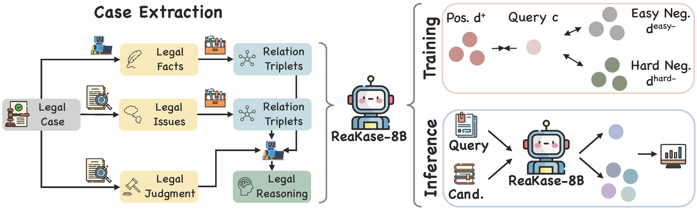
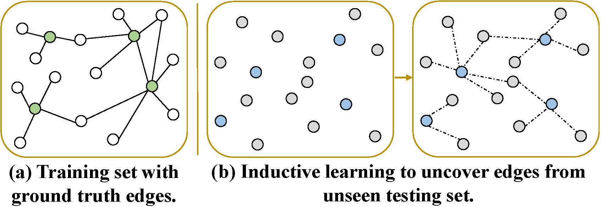
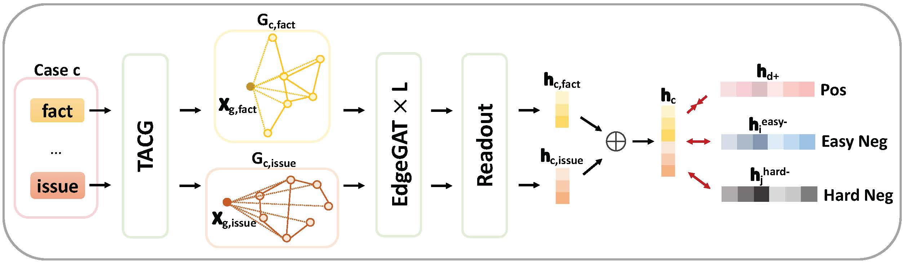
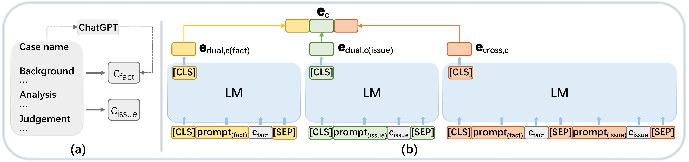

汤嫣然

I am currently a Postdoctoral Researcher at <a href="https://www.uq.edu.au" target="_blank"> The University of Queensland (UQ)</a>. I recently completed my PhD at UQ, supervised by Professors <a href="http://staff.itee.uq.edu.au/huang/" target="_blank"> Helen Huang</a> and <a href="https://researchers.uq.edu.au/researcher/973" target="_blank"> Xue Li</a>. I obataied my Bachelor of Law (LL.B.)⚖️ and Master of Law (LL.M.)⚖️ degrees in 2018 and 2021 respectively.

My research focuses on artificial intelligence for the legal domain, particularly legal information retrieval, legal reasoning, and legal decision-making. I am especially interested in graph neural networks (GNNs) and large language models (LLMs), and their applications to real-world legal tasks.

Talks
=====
* 06.2024 Give a talk, "Effective Representation Learning for Legal Case Retrieval", at IR Seminar, The University of Glasgow. [\[slides\]](../files/Glasgow_tyr_LCR.pdf){:target="_blank"}

* 05.2024 Give a talk, "Effective Representation Learning for Legal Case Retrieval", at THUIR, Tsinghua University. [\[slides\]](../files/THUIR_tyr_LCR.pdf){:target="_blank"}

* 03.2024 Give a talk, "Graph Neural Networks for Legal Case Retrieval with Text-Attributed Graphs", at [IRonGraphs Workshop at ECIR 2024](https://irongraphs.github.io/ecir2024/){:target="_blank"}. [\[slides\]](../files/ECIR_IRonGraph_tyr_LCR.pdf){:target="_blank"}

Selected Research
=====
<a href="https://scholar.google.com.au/citations?user=KmR5XoQAAAAJ&hl=en" target="_blank">Google Scholar</a> page includes the full publication list.

<table style="width:100%;border:0px;border-spacing:0px;border-collapse:separate;margin-right:auto;margin-left:auto;font-size:1em;"><tbody>
          <tr>
            <td style="padding:0 12px 0 0;width:25%;vertical-align:middle">
              
            </td>
            <td width="75%" valign="middle">
              <strong>Cassette: Case-to-Case Structural Distillation for Efficient Legal Case Retrieval</strong>
               
              <strong>Yanran Tang</strong>, Ruihong Qiu, Hongzhi Yin, Xue Li, Zi Huang
               
              TOIS 2026
               
              <a href="https://dl.acm.org/doi/full/10.1145/3816732" target="_blank">arXiv</a> /
              <a href="https://github.com/yanran-tang/Cassette/" target="_blank">code</a>
              

              

              

                A knowledge distillation framework that transfers structural knowledge from graph neural networks to lightweight legal case representations, enabling efficient and effective legal case retrieval.
              

            </td>
          </tr>
<tr><td colspan="2">
</td></tr>
          <tr>
            <td style="padding:0 12px 0 0;width:25%;vertical-align:middle">
              
            </td>
            <td width="75%" valign="middle">
              <strong>LEXA: Legal case retrieval via graph contrastive learning with contextualised LLM embeddings</strong>
               
              <strong>Yanran Tang</strong>, Ruihong Qiu, Yilun Liu, Xue Li, Zi Huang
               
              WWWJ 2026
               
              <a href="https://link.springer.com/article/10.1007/s11280-026-01407-w" target="_blank">arXiv</a> /
              <a href="https://github.com/yanran-tang/CaseGNN" target="_blank">code</a>
              

              

              

                A graph contrastive learning framework that leverages graph augmentation to provide enhanced training signals, while integrating contextualised LLM embeddings to learn more expressive legal case representations for accurate legal case retrieval.
              

            </td>
          </tr>
<tr><td colspan="2">
</td></tr>
          <tr>
            <td style="padding:0 12px 0 0;width:25%;vertical-align:middle">
              
            </td>
            <td width="75%" valign="middle">
              <strong>ReaKase-8B: Legal Case Retrieval via Knowledge and Reasoning Representations with LLMs</strong>
               
              <strong>Yanran Tang</strong>, Ruihong Qiu, Xue Li, Zi Huang
               
              ADC 2025
               
              <a href="https://arxiv.org/abs/2510.26178" target="_blank">arXiv</a> /
              <a href="https://github.com/yanran-tang/ReaKase-8B" target="_blank">code</a>
              

              

              

                A reasoning-enhanced LLM architecture that integrates structured legal knowledge to more effectively bridge the gap between case facts and judicial outcomes, thereby enabling more accurate legal case retrieval.
              

            </td>
          </tr>
<tr><td colspan="2">
</td></tr>
          <tr>
            <td style="padding:0 12px 0 0;width:25%;vertical-align:middle">
              
            </td>
            <td width="75%" valign="middle">
              <strong>CaseLink: Inductive Graph Learning for Legal Case Retrieval</strong>
               
              <strong>Yanran Tang</strong>, Ruihong Qiu, Hongzhi Yin, Xue Li, and Zi Huang
               
              SIGIR 2024
               
              <a href="https://arxiv.org/abs/2403.17780" target="_blank">arXiv</a> /
              <a href="https://github.com/yanran-tang/CaseLink" target="_blank">code</a>
              

              

              

                An inductive graph learning paradigm for legal case retrieval is proposed to tackle the challenge of unseen testing query and candidate cases.
              

            </td>
          </tr>
<tr><td colspan="2">
</td></tr>
          <tr>
            <td style="padding:0 12px 0 0;width:25%;vertical-align:middle">
              
            </td>
            <td width="75%" valign="middle">
              <strong>CaseGNN: Graph Neural Networks for Legal Case Retrieval with Text-Attributed Graphs</strong>
               
              <strong>Yanran Tang</strong>, Ruihong Qiu, Yilun Liu, Xue Li, Zi Huang
               
              ECIR 2024
               
              <a href="https://arxiv.org/abs/2312.11229" target="_blank">arXiv</a> /
              <a href="https://github.com/yanran-tang/CaseGNN" target="_blank">code</a>
              

              

              

                A structural modelling of law case with GNN for effective retrieval is introduced.
              

            </td>
          </tr>
<tr><td colspan="2">
</td></tr>
          <tr>
            <td style="padding:0 12px 0 0;width:25%;vertical-align:middle">
              
            </td>
            <td width="75%" valign="middle">
              <strong>Prompt-based Effective Input Reformulation for Legal Case Retrieval</strong>
               
              <strong>Yanran Tang</strong>, Ruihong Qiu, Xue Li
               
              ADC 2023
               
              <a href="https://arxiv.org/abs/2309.02962" target="_blank">arXiv</a> /
              <a href="https://github.com/yanran-tang/PromptCase" target="_blank">code</a>
              

              

              

                An effective legal case retriver that focus on legal feature alignment with the aid of LM prompting and LLM summarisation is introduced.
              

            </td>
          </tr>

</tbody>
</table>

Honors and Awards
=====
* **Runner-up** in Task 1: Legal Case Retrieval, Competition on Legal Information Extraction/Entailment (COLIEE) 2025
* **Student Support Grants**, ECIR 2024
* **Third Prize** in Task 1: Legal Case Retrieval, Competition on Legal Information Extraction/Entailment (COLIEE) 2023
* **Third Prize** in Legal Case Retrieval Track, Competition of Challenge of AI in Law (CAIL) 2023
* **Gold CIRES-ADC Travel Grant**, CIRES PhD School and the Australasian Database Conference (ADC) 2023
* **UQ Graduate School Scholarship**, Graduate School, The University of Queensland (2023-2026)
* **SCUT Graduate Scholarship**, School of Law, South China University of Technology (2018-2021)

MISC
=====
I speak Cantonese, Mandarin and English.

<tr><td colspan="2">
</td></tr>

Updated on 07/09/2026.

